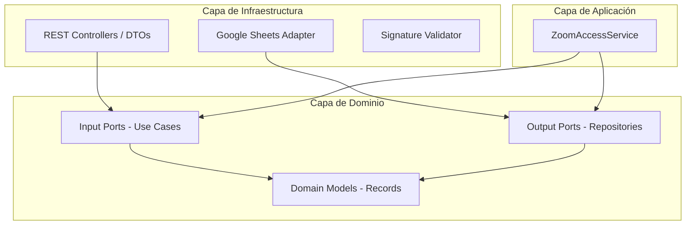

# Reporte de Análisis: Reactividad, Arquitectura Limpia y Diagnóstico de Webhooks

Este documento presenta una revisión técnica exhaustiva del backend de **ZoomAccessDashboard**. El análisis se divide en tres secciones principales:
1. **Evaluación de Reactividad (WebFlux & Código Bloqueante)**
2. **Evaluación de la Arquitectura Limpia (Estructura y Dependencias)**
3. **Diagnóstico del Webhook y Causas de Parada Abrupta (Exit Code 1)**

---

## 1. Evaluación de Reactividad (WebFlux y Código Bloqueante)

La aplicación utiliza **Spring WebFlux** para implementar un flujo no bloqueante. Tras revisar los controladores, servicios y adaptadores, se determinó el nivel de cumplimiento reactivo:

### Puntos Fuertes (Cumplimiento Reactivo)
* **Uso de Tipos Reactivos**: Los controladores (`ZoomWaitingRoomController` y `ZoomWebhookController`) retornan `Mono` y `Flux` de manera consistente.
* **Aislamiento de Código Bloqueante**: La interacción con la API de Google Sheets (que es intrínsecamente síncrona/bloqueante) en `GoogleSheetsAdapter.java` se envuelve usando `Mono.fromCallable(...)` y se delega a `Schedulers.boundedElastic()`. Esto evita que las llamadas bloqueantes congelen los hilos del Event Loop de Netty.
* **Flujos Funcionales**: El procesamiento y filtrado de datos en `ZoomAccessService.java` se realiza usando operadores reactivos (`filter`, `map`, `flatMap`, `collectList`, etc.) sin recurrir a bucles `for` o condicionales `if-else` tradicionales.

### Hallazgos Críticos y Oportunidades de Mejora

#### A. Suscripciones No Gestionadas (Fire-and-Forget)
En `ZoomWebhookController.java#processWebhookAsync` (líneas 92-103), se ejecuta el procesamiento del webhook en segundo plano usando:
```java
Mono.defer(() -> processWebhookUseCase.process(payload))
    .subscribeOn(Schedulers.boundedElastic())
    .subscribe(
        null,
        error -> log.error("Failed to process Zoom webhook asynchronously", error)
    );
```
> [!WARNING]
> **Código de Riesgo (Code Smell)**: Suscribirse manualmente a un flujo reactivo dentro de un controlador sin gestionar la suscripción (`Disposable`) es una mala práctica en WebFlux. 
> * **Pérdida de control**: Spring no tiene conocimiento del ciclo de vida de este hilo de fondo. Si el servidor se apaga o reinicia mientras se procesa la petición de Google Sheets, la ejecución se cortará abruptamente sin posibilidad de rollback o reintento.
> * **Falta de Backpressure**: Si Zoom envía cientos de webhooks en ráfaga, se crearán cientos de suscripciones en paralelo en el pool `boundedElastic`, lo que puede saturar el procesador o la memoria.

#### B. La API de Google Sheets es Síncrona por Naturaleza
Aunque se utiliza `Schedulers.boundedElastic()` para no bloquear a Netty, el SDK oficial de Google (`google-api-services-sheets`) realiza peticiones HTTP/1.1 bloqueantes a nivel de socket.
* *¿Es 100% reactivo nativo?* **No**. Es un envoltorio reactivo sobre código bloqueante.
* *Solución Ideal*: Para una arquitectura 100% reactiva y no bloqueante nativa, se debería consumir la API REST de Google Sheets utilizando `WebClient` de Spring WebFlux directamente, eliminando el SDK síncrono de Google. Sin embargo, usar `Schedulers.boundedElastic()` es la solución recomendada si se prefiere mantener la simplicidad del SDK oficial.

---

## 2. Evaluación de Arquitectura Limpia

El proyecto sigue una estructura inspirada en la Arquitectura Hexagonal / Limpia con las carpetas `domain`, `application` e `infrastructure`.



### Violación de la Regla de Dependencia (Dependency Inversion)
La regla fundamental de la Arquitectura Limpia establece que **las capas internas (Dominio y Aplicación) no deben conocer nada de las capas externas (Infraestructura, Frameworks, HTTP, Base de Datos)**.

> [!CAUTION]
> **Violación Encontrada**:
> En `ZoomAccessService.java` (Aplicación) y `ProcessWebhookUseCase.java` (Dominio/Puerto), se importa directamente la clase `ZoomPayloadDto`:
> `import com.ZoomAccessDashboard.zoomaccess.infrastructure.input.rest.dto.ZoomPayloadDto;`
>
> Esto significa que tu caso de uso del dominio y tu servicio de aplicación dependen directamente de un DTO de la infraestructura de transporte (HTTP REST). Si el formato del JSON de entrada de Zoom cambia, o si decides migrar de REST a un sistema de mensajería (como gRPC o RabbitMQ), tendrás que modificar la interfaz del caso de uso de dominio y el servicio.

#### ¿Cómo solucionarlo?
El controlador HTTP (`ZoomWebhookController`) es el responsable de recibir el DTO de infraestructura (`ZoomPayloadDto`), validarlo y **mapearlo** a un modelo de dominio puro o a un comando de aplicación (ej. `ProcessWebhookCommand` o `ZoomAccessRecord` directamente) antes de invocar al caso de uso.
* **Uso sugerido**:
  ```java
  // En el Controller, antes de llamar al UseCase:
  ZoomAccessRecord domainRecord = payloadDto.toDomain(); // Método de mapeo
  return processWebhookUseCase.process(domainRecord);
  ```
  De esta forma, la interfaz `ProcessWebhookUseCase` recibiría un objeto de dominio puro (`ZoomAccessRecord`), eliminando la dependencia hacia el paquete de infraestructura.

---

## 3. Diagnóstico del Webhook y Causas de Salida Abrupta (Exit Code 1)

Un **Exit Code 1** en una aplicación Java de Spring Boot indica una finalización anómala de la ejecución de la JVM. A continuación, se detallan las razones técnicas por las que esto puede suceder en el contexto de esta aplicación:

### A. Fallo de Inicialización en el Startup (Bloqueo en `@PostConstruct`)
En `GoogleSheetsAdapter.java` (líneas 55-77), el método `init()` se ejecuta de forma síncrona durante el arranque del contexto de Spring:
```java
@PostConstruct
public void init() {
    try {
        // Carga de credenciales y conexión inicial
    } catch (Exception e) {
        log.error("Failed to initialize Google Sheets Adapter", e);
        throw new RuntimeException("Failed to initialize Google Sheets Service", e);
    }
}
```
Si ocurre cualquiera de los siguientes problemas en el arranque, la aplicación lanzará una excepción que detendrá el inicio de Spring Boot y causará un **Exit Code 1**:
1. **Archivo de credenciales ausente o corrupto**: Si `credentials.json` no está en el classpath (bajo `src/main/resources/`) o la ruta del sistema de archivos es inválida.
2. **Formato JSON inválido**: Si el contenido de `credentials.json` no es un JSON válido de cuenta de servicio de Google.
3. **Falta de conectividad inicial**: Si el servidor no puede comunicarse con los servidores de autenticación de Google durante `GoogleNetHttpTransport.newTrustedTransport()` debido a restricciones de red, proxies mal configurados o caída de DNS.

### B. Agotamiento de Memoria (OutOfMemoryError - OOM)
El adaptador de Google Sheets implementa la lectura de datos descargando la hoja completa en memoria:
```java
// GoogleSheetsAdapter.java
ValueRange response = sheetsService.spreadsheets().values()
        .get(spreadsheetId, range + "!A:F")
        .execute();
List<List<Object>> values = response.getValues();
```
Y el servicio realiza la agregación de forma secuencial en memoria:
```java
// ZoomAccessService.java
private List<WaitingRoomRecord> aggregateRecords(List<ZoomAccessRecord> records) {
    Map<String, List<ZoomAccessRecord>> grouped = records.stream().collect(...);
    ...
}
```
> [!DANGER]
> **Riesgo de Crash de la JVM**:
> A medida que la hoja de cálculo de Google Sheets acumule miles de registros históricos (eventos de Zoom webhook de entrada, salida y admisión):
> 1. Cada petición de listado descargará y almacenará en memoria una matriz masiva de strings (`List<List<Object>>`).
> 2. El proceso de mapeo y agrupación creará miles de objetos temporales en el Heap de Java de corta duración.
> 3. Si la memoria asignada a la JVM (especialmente en entornos de contenedores limitados como Docker, AWS ECS, Render con 512MB) se agota, la JVM lanzará un `java.lang.OutOfMemoryError: Java heap space`.
> 4. Un `OutOfMemoryError` en hilos de fondo del pool de ejecución de Reactor puede hacer que el servidor se vuelva inestable o que el proceso de Java termine abruptamente con **Exit Code 1** (o **137** si es destruido por el OOM Killer del sistema operativo).

### C. Finalización Abrupta en Contenedores (SIGTERM / SIGKILL Timeout)
Si la aplicación se despliega en plataformas en la nube (Docker, Kubernetes, Render, Heroku, AWS):
1. Al realizar un nuevo despliegue o reinicio, la plataforma envía una señal `SIGTERM` al proceso de Java para indicarle que debe apagarse.
2. La plataforma otorga un tiempo de gracia (usualmente 30 segundos) para que la aplicación termine las conexiones y tareas activas.
3. Debido al uso de la suscripción desacoplada (`processWebhookAsync`), Spring Boot no sabe que hay hilos del pool `boundedElastic` escribiendo en Google Sheets en segundo plano. Spring destruirá los beans inmediatamente.
4. Si un hilo de fondo está en medio de una llamada de red síncrona bloqueada con Google Sheets, y el tiempo de gracia expira, el orquestador enviará una señal `SIGKILL`.
5. Esto mata instantáneamente el proceso de Java, lo cual se registra en los logs de la plataforma como finalización anómala con **Exit Code 1** o **137**.

### D. Conflicto de Puerto
Si la aplicación intenta iniciarse en un puerto que ya está ocupado por otro proceso (por ejemplo, el puerto `8080` usado comúnmente), Spring Boot lanzará una excepción `PortInUseException` en el hilo principal y terminará el proceso con **Exit Code 1**.

### E. Token de Seguridad No Configurado
En `ZoomSignatureValidator.java`:
```java
public String encryptToken(String plainToken) {
    return java.util.Optional.ofNullable(secretToken)
            .filter(token -> !token.isBlank())
            .map(token -> new HmacUtils(HmacAlgorithms.HMAC_SHA_256, token).hmacHex(plainToken))
            .orElseThrow(() -> new IllegalStateException("Zoom Secret Token is not configured"));
}
```
Si el webhook de Zoom realiza una validación de URL (desafío CRC) y la propiedad `zoom.secret-token` no está configurada en `application.properties` (o variables de entorno), se lanzará una `IllegalStateException`.
Aunque esto normalmente se propaga como un error 500 en Spring WebFlux, si ocurre en un punto crítico no gestionado, podría bloquear el procesamiento del webhook.

---

## 4. Plan de Acción Recomendado

Para resolver las vulnerabilidades arquitectónicas, asegurar la reactividad y evitar salidas abruptas (`Exit Code 1`), se proponen los siguientes cambios:

| Componente | Problema | Solución Recomendada |
| :--- | :--- | :--- |
| **Controlador Webhook** | Fire-and-forget `.subscribe()` no gestionado. | Retornar el flujo reactivo completo en el controlador para que Spring gestione la petición de forma asíncrona, o delegar a una cola de mensajes en memoria (ej. `Sinks.many().multicast()`) debidamente acoplada al ciclo de vida de la aplicación. |
| **Arquitectura Limpia** | Dependencia del caso de uso de Dominio en `ZoomPayloadDto`. | Crear un método de mapeo en `ZoomPayloadDto` o en el controlador para transformar el DTO a un registro de dominio puro (`ZoomAccessRecord`) antes de pasarlo al caso de uso. |
| **Google Sheets Adapter** | Carga completa de la hoja en memoria (Riesgo de OOM). | Implementar paginación o lecturas acotadas de Google Sheets en lugar de recuperar toda la hoja. De forma alternativa, migrar a una base de datos reactiva para el almacenamiento operativo y usar Google Sheets solo para reportes asíncronos. |
| **Ciclo de vida de la App** | Cierre abrupto de hilos en apagados (SIGKILL). | Habilitar el apagado seguro de Spring Boot configurando `server.shutdown=graceful` en `application.properties`. |
